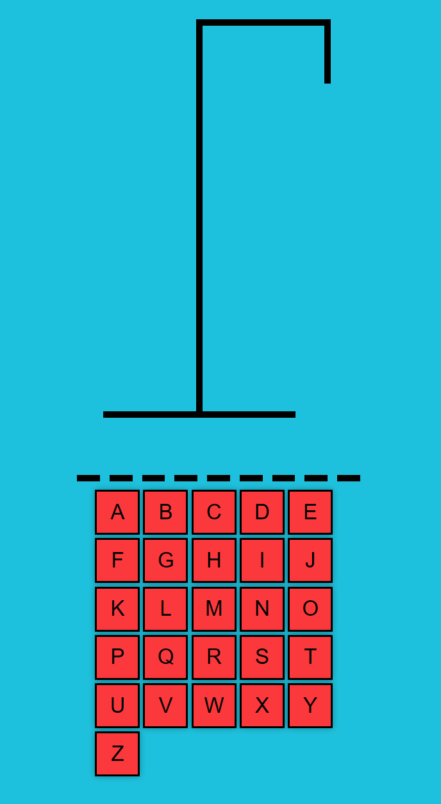

# Hangman Game

This Hangman game is built using React, Vite, and TypeScript.



## Features

- Interactive Hangman game with a graphical user interface.
- Randomly selects words for the player to guess.
- Maximum six attempts.
- Highlights correct and incorrect guesses.
- Tracks and displays letters already guessed.
- Responsive design.

## Game Rules

- The game selects a word at random, which the player needs to guess.
- The player has a limited number of attempts to guess the word.
- Each incorrect guess results in losing a life (represented by the hangman figure).
- The game ends when the player guesses the entire word correctly or runs out of attempts.

## How to Use

1. Clone this repository to your local machine.

```bash
git clone https://github.com/your-username/hangman-game.git
```

2. Navigate to the project directory.

```bash
cd Hangman-Game
```

3. Start the application.

```bash
npm run dev
```

4. Open your web browser on the correct port to access the Hangman game.

5. Start guessing letters to uncover the hidden word and enjoy playing the game!

## Technologies Used

- React
- TypeScript
